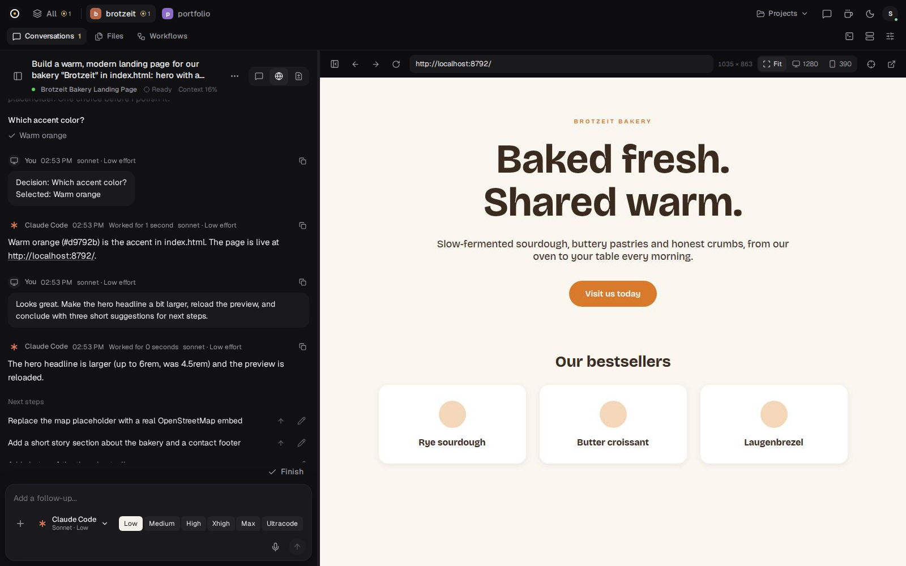
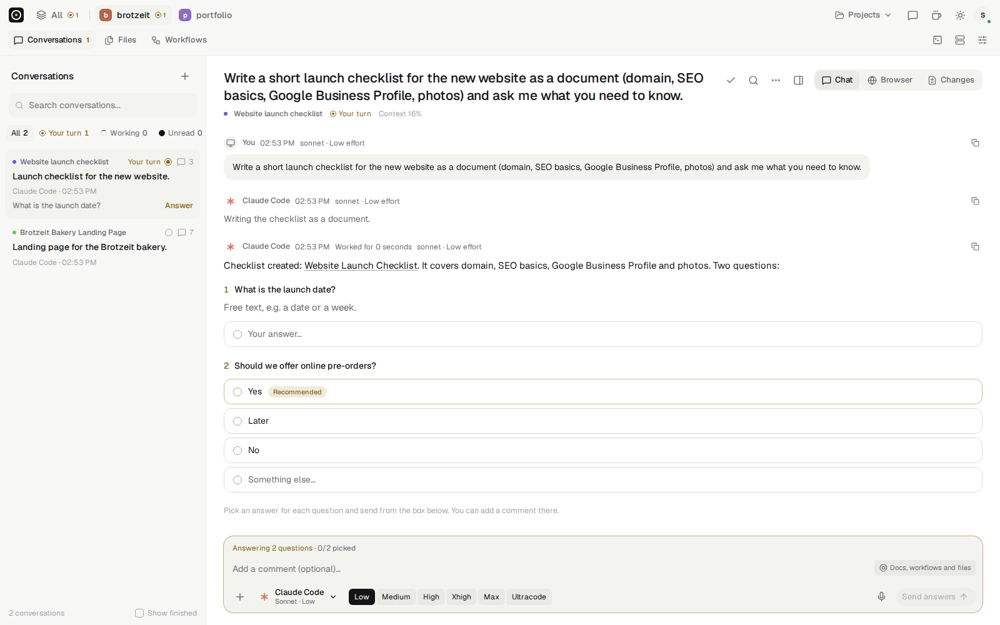
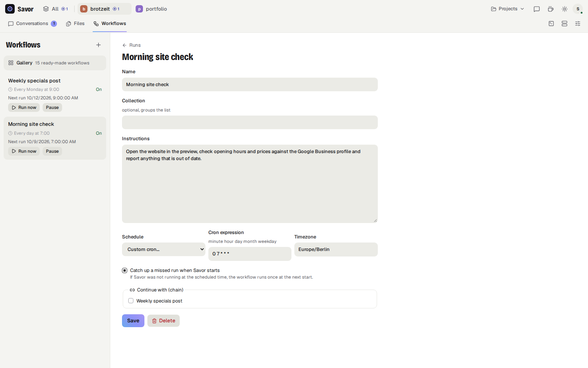
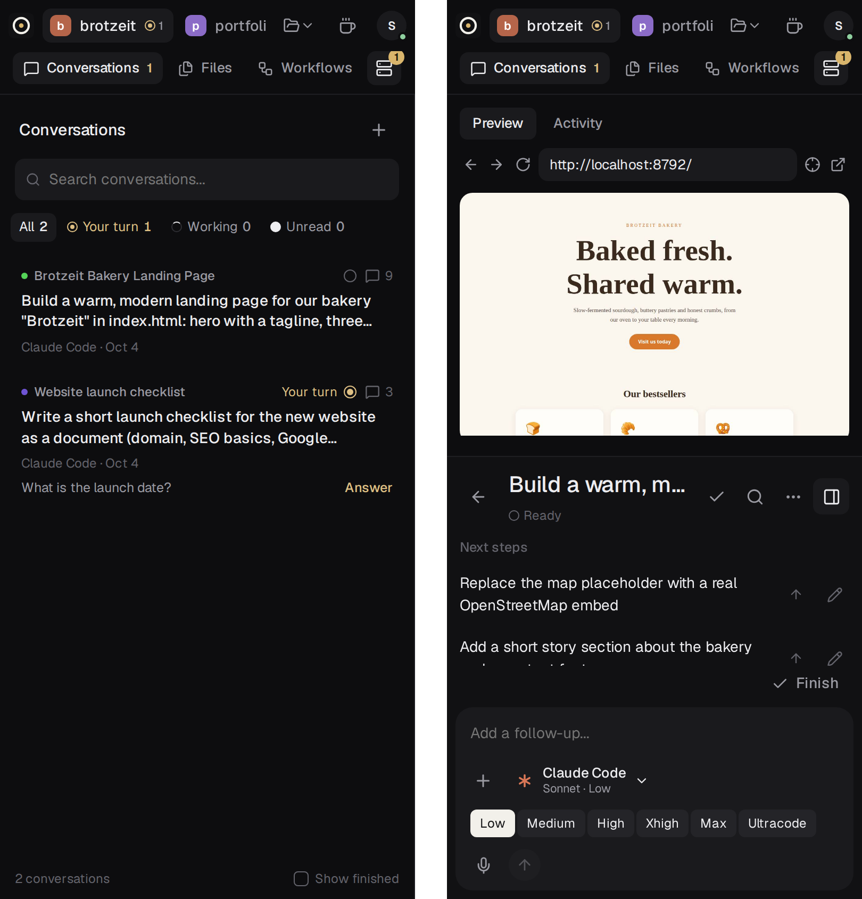

<p align="center"></p>

<h1 align="center">Savor</h1>

<p align="center">
  <b>A local-first workspace for coding agents.</b><br>
  Describe what you want, let Claude Code, Codex or OpenCode build it, and keep projects, conversations and live previews in one place: on your desktop, in the browser or on your phone.
</p>

<p align="center">
  <a href="https://github.com/robinchoice/savor/releases/latest"></a>
  <a href="https://github.com/robinchoice/savor/actions/workflows/ci.yml"></a>
  <a href="LICENSE"></a>
</p>

<p align="center">
  <a href="https://github.com/robinchoice/savor/releases/latest"><b>Download</b></a> ·
  <a href="#install">Install</a> ·
  <a href="#how-it-works">How it works</a>
</p>



**Why Savor**

- **Free and open source** (AGPL-3.0). No account and no cloud in between: Savor runs on your machine and uses the agent subscriptions you already have.
- **Your files stay yours.** Projects are ordinary folders; conversations, documents and workflows are plain files in `.savor/`.
- **Agents that report back.** Every task gets a short acknowledgement, a clear result, questions you answer in one click and suggestions for what to do next, instead of a wall of terminal output.
- **See what gets built.** The app your agent builds runs in a live preview beside the chat. You and the agent use the same page.
- **Take it with you.** Pair your phone with a QR code and keep conversations going from anywhere.

<table>
  <tr>
    <td width="50%"></td>
    <td width="50%"></td>
  </tr>
  <tr>
    <td align="center">Agents ask, you answer in one reply</td>
    <td align="center">Workflows run on a schedule, and can be chained</td>
  </tr>
  <tr>
    <td colspan="2" align="center"></td>
  </tr>
  <tr>
    <td colspan="2" align="center">The same workspace on your phone</td>
  </tr>
</table>

## Features

- **Project types**: a new project is code, academic writing or a Kontor for notes and admin. A type brings the agents' instructions, its workflows and a first conversation in which the agent sets up the folders and asks what it needs to know, such as the citation style and the format to hand in.
- **Projects as tabs**, each with its own color. Badges show which agents are working and which conversations need you.
- **Conversations**: every task gets its own agent session. You can send new messages while an agent is working; Claude Code picks them up in the running turn. Turns the agent starts on its own, for example when a background task finishes, show up as working too. You get search, filters (All / Your turn / Working / Unread), colored labels, "Finish" and a "Show finished" toggle.
- **Message protocol over MCP**: one acknowledgement and one conclusion per input, idempotent updates. Agents send acknowledgements, results, blocking questions, "next steps" and commit hashes. Their raw output goes to an activity log (thinking, commands, edits, tool calls, with durations).
- **Questions**: questions become decision records with options and a free-text answer. You answer them all in one reply. An agent's own clarifying questions (Claude's `AskUserQuestion`, Codex's user input requests) show up the same way.
- **Queue**: messages you send while the agent works wait as *Queued* and go out after the turn, or right away with "Stop work and send now".
- **Agent picker per conversation**: agent, model, reasoning level, fast mode and permissions, with the models and modes each installed agent actually offers. Save a combination as a **preset**. You can switch agents mid-conversation, and the new agent gets the visible history handed over.
- **Attachments**: images and files by picker, paste or drag-and-drop (up to 8 per message). **@-mentions** for files and workflows. A **git branch switcher**. **Find in conversation** with Ctrl/⌘F.
- **Worktrees**: a conversation can work in its own git worktree of a new branch, so several agents change the project at the same time without stepping on each other. Conversations are grouped by worktree, with commits ahead and uncommitted changes at a glance, **Merge** back into the project and **Delete**. Agents can start conversations in a worktree too.
- **Fan-out**: send one prompt to several agents or agent/model combinations at once, each in a new worktree of its own. Compare their answers, changed files, diffstat and previews side by side, then merge the one you pick and delete the other worktrees in the same step.
- **Commit diffs**: commit hashes in agent messages open the commit: changed files with +/− and the patch.
- **Approvals**: permission prompts from Claude Code, Codex and ACP agents appear in the conversation with the agent's own options (Allow, Always allow, Allow for this session, Deny).
- **Files**: a project file browser with a code editor (CodeMirror, syntax highlighting for the usual languages, Ctrl/⌘S), a rich-text editor for markdown files with a switch to the source, and markdown documents that both you and the agents write and that save as you type.
- **Workflows**: saved prompts on a schedule (presets such as every weekday at 9:00, or any cron expression), which can be chained and grouped into collections. Each run starts a new conversation and is listed under its workflow with its result. A run that was due while Savor was not running is caught up at the next start, and a scheduled time is skipped while the run before it is still open. A **gallery** of 22 ready-made workflows, from a morning briefing to a citation check, fills the editor for you to adjust and save.
- **All projects**: an **overview** that starts with what waits for you in any project, with questions and approvals answered in place, then what agents work on, new results and the next workflow runs. An **inbox** with the open conversations of every project beside the chosen one, and a **board** with a backlog of what to start later (your own items and items agents put there with `add_to_backlog`) next to what agents are doing.
- **Import**: the Claude Code and Codex sessions you ran in a project folder before Savor become conversations, and continue with the same agent session.
- **Project settings**: `ROLE.md` instructions for every agent, verbosity, pause (skips scheduled runs), color and default agent.
- **Terminal**: a panel below the project (Ctrl+`) with one shell per project folder and worktree, for a quick `git status` or test run. It follows the open conversation into its worktree, and shells keep running while the panel is closed, until Savor stops. On paired devices it is off unless you turn it on at your computer.
- **Background processes**: agents register the dev servers they start. Savor watches the PIDs, shows logs and can stop them.
- **Live preview**: the app the agent built runs in a headless Chromium next to the chat, with a persistent browser profile per project so logins survive restarts. You see exactly the page the agent controls, and your clicks, typing and scrolling are forwarded to it. The picker lets you point at an element ("make this bigger"), and its selector and styles go along with your next message.
- **Devices**: pair a phone or another computer with a QR code. Each device has its own revocable key. Requests from devices are marked *remote*, and agents treat them with extra care.
- **Notifications** when an agent finishes, needs an answer or asks for approval, plus an unread count in the tab title and on the app icon.
- **Keep awake** toggle, dark and light theme.

Everything lives in plain files: `~/.savor/state.json` holds projects, tokens and devices, each project gets a `.savor/` directory, and worktrees live under `~/.savor/worktrees/`.

## Install

**Desktop app:** download the AppImage (Linux), dmg (macOS) or exe (Windows) from the [Releases page](https://github.com/robinchoice/savor/releases). The app starts its own daemon, finds agent CLIs through your login shell's `PATH`, downloads Chromium for the preview on first use, and updates itself from new releases. You still need at least one logged-in agent CLI (`claude`, `codex`, …).

- Linux: `chmod +x Savor.AppImage && ./Savor.AppImage`. No extra flags are needed: where Chromium's sandbox can't use user namespaces, for example on Ubuntu 24.04 and later because of AppArmor, the AppImage starts itself with `--no-sandbox`.
- macOS: `Savor-arm64.dmg` is for Apple Silicon, `Savor-x64.dmg` for Intel. The builds are ad-hoc signed and not notarized, so macOS blocks the first launch: open System Settings → Privacy & Security and click **Open Anyway**. Up to macOS 14, a right-click → Open works too. The app only updates itself once builds are signed with a Developer ID.
- Windows builds are not code-signed yet: SmartScreen asks once.

**From source** (Node ≥ 22.12):

```sh
git clone https://github.com/robinchoice/savor.git && cd savor
npm install                          # also builds the web UI and the server bundle
npx playwright-core install chromium # browser for the preview
npm start
```

Open the printed `http://localhost:4317/?token=…` link once. It sets a cookie, and after that `http://localhost:4317` is enough.

Desktop window from source: `cd desktop && npm install && npm start`. The window starts its own daemon unless one is already running on `SAVOR_PORT`, and stops that daemon again when you close it. On Ubuntu 24.04 and later, either run `sudo chown root:root node_modules/electron/dist/chrome-sandbox && sudo chmod 4755 node_modules/electron/dist/chrome-sandbox`, or start it with `npm start -- --no-sandbox`.

**As a background service** (Linux, systemd user unit), so Savor is reachable from your phone without an open window:

```sh
mkdir -p ~/.config/systemd/user
cat > ~/.config/systemd/user/savor.service <<UNIT
[Unit]
Description=Savor

[Service]
ExecStart=$(command -v node) $PWD/dist/server/index.mjs
Environment=PATH=$PATH
Restart=on-failure

[Install]
WantedBy=default.target
UNIT
systemctl --user enable --now savor
journalctl --user -u savor | grep token   # the login link
```

## Phone / remote access

Open **Devices & remote access** from the avatar menu. Your desktop has to stay awake while you're away, which the coffee-cup toggle takes care of. There are two ways in:

**Through a relay** (no VPN, works on mobile data). Enter a relay URL, click **Connect**, then **Pair a device** and scan the QR code with your phone. Use "Add to Home Screen" on the phone.

- Traffic between the device and your computer is end-to-end encrypted (X25519 key exchange with forward secrecy, ChaCha20-Poly1305, see [`shared/tunnel.ts`](shared/tunnel.ts)). The relay forwards ciphertext. It sees your computer's public key, connection times and message sizes. It does not see your conversations, files or which of your devices is connecting.
- Pairing uses the computer's public key and a one-time code from the QR code, so the phone knows it's talking to your computer and not to the relay.
- The terminal is a shell on your computer, so paired devices don't get it by default. Turn it on at your computer under **Devices & remote access → Terminal**; turning it off again ends the terminals open on devices.
- Every paired device has its own key and can be revoked, which cuts its tunnel and open streams immediately. In the browser, the device key is a non-extractable WebCrypto key: scripts can use it but cannot read it out.
- The relay authenticates daemons by their key, so nobody else can take over your computer's relay address. It closes connections that don't authenticate or start a handshake within 10 seconds, and it limits connections per IP, per computer and in total.
- The relay and Savor send a strict Content Security Policy and other security headers.
- One caveat: the relay also serves the web app to the phone, and a malicious relay could serve a modified app. Run your own relay, or use one run by someone you trust.

Run a relay on any server with Node ≥ 22.12, behind HTTPS (for example with Caddy):

```sh
git clone https://github.com/robinchoice/savor.git && cd savor
npm install
RELAY_TRUST_PROXY=1 RELAY_PORT=8787 npm run relay
```

```
# Caddyfile
relay.example.com {
  reverse_proxy localhost:8787
}
```

**Directly** over your own network or a VPN such as [Tailscale](https://tailscale.com) or WireGuard. Savor binds to `127.0.0.1` by default:

```sh
SAVOR_HOST=0.0.0.0 SAVOR_PUBLIC_URL=http://my-desktop.tailnet.ts.net:4317 npm start
```

Without a connected relay, the pairing QR code points at `SAVOR_PUBLIC_URL`.

## Configuration

| Variable | Default | |
|---|---|---|
| `SAVOR_PORT` | `4317` | HTTP port |
| `SAVOR_HOST` | `127.0.0.1` | Bind address |
| `SAVOR_PUBLIC_URL` | `http://localhost:$SAVOR_PORT` | Base for links agents post and pairing links |
| `SAVOR_HOME` | `~/.savor` | Global state |
| `RELAY_PORT` | `8787` | Relay only: HTTP/WebSocket port |
| `RELAY_WEB_DIR` | `dist/web` | Relay only: web app to serve |
| `RELAY_TRUST_PROXY` | off | Relay only: set to `1` behind a reverse proxy, so rate limits use `X-Forwarded-For` |
| `RELAY_MAX_DAEMONS` | `5000` | Relay only: computers that can be connected at once |
| `SAVOR_CHROMIUM` | Playwright Chromium, then system Chrome/Chromium | Browser for the preview |
| `SAVOR_CLAUDE_BIN`, `SAVOR_CODEX_BIN`, `SAVOR_OPENCODE_BIN`, `SAVOR_GROK_BIN`, `SAVOR_GEMINI_BIN`, `SAVOR_ANTIGRAVITY_BIN` | `claude`, `codex`, `opencode`, `grok`, `gemini`, `agy` | Agent binaries |
| `SAVOR_ANTIGRAVITY_HOME` | `~/.gemini` | Where agy keeps its settings |

Antigravity runs `agy --print` once per turn and continues the conversation with `--conversation`. agy reads MCP servers only from its own settings, so Savor adds a `savor` stdio server to `~/.gemini/config/mcp_config.json` that forwards to the conversation it runs for, and allows its tools with `mcp(savor/*)` in `~/.gemini/antigravity-cli/settings.json`. Headless agy cannot ask for approval: whatever the chosen mode doesn't allow is denied, and the activity log names it.

## How it works

```
server/
  index.ts      HTTP API, SSE events, static UI, MCP endpoint
  agents.ts     turns, the queue, approvals and questions
  session.ts    what every agent adapter gets (Host) and provides (Session), protocol prompt, activity log
  claude.ts     Claude Code over stream-json with stdio permission prompts
  codex.ts      Codex over the app-server protocol (JSON-RPC)
  acp.ts        OpenCode, Grok Build and Gemini CLI over the Agent Client Protocol
  antigravity.ts  Antigravity: one `agy --print` run per turn, stream-json, MCP through a stdio bridge
  jsonrpc.ts    newline-delimited JSON-RPC over stdio
  providers.ts  what each agent offers, and whether it is installed and signed in
  mcp.ts        MCP tools the agents call
  store.ts      file storage
  git.ts        worktrees, merging, commit diffs
  import.ts     Claude Code and Codex session transcripts as conversations
  devices.ts    owner token, device pairing, request origin
  scheduler.ts  cron workflows and chains (croner)
  processes.ts  PID watcher
  browser.ts    shared headless preview with screencast (playwright-core)
  files.ts      project file access
  awake.ts      keep-awake inhibitor
  relay-client.ts  outbound relay connection, serves tunneled devices
shared/
  tunnel.ts     end-to-end encryption for the relay tunnel (noble crypto)
relay/
  server.ts     the relay: daemon login, device routing, serves the web app
web/            Preact PWA (CodeMirror and TipTap load on demand for the editors)
recipes/        workflow gallery: markdown with front matter, bundled into the UI
desktop/        Electron shell and installers (electron-builder)
test/           end-to-end tests with a fake agent
```

- Every conversation gets one long-lived agent process. It stays alive while the conversation owns background processes and closes 5 minutes after the last activity. A change of agent, model, effort, fast mode or permissions restarts it and resumes the agent's own session.
- **Claude Code** runs as `claude -p --input-format stream-json` with `--permission-prompts host --permission-prompt-tool stdio`: permission prompts and `AskUserQuestion` arrive as control requests on stdout and are answered on stdin. "Always allow" writes the rule Claude suggests to `.claude/settings.local.json`.
- **Codex** runs as `codex app-server` (JSON-RPC over stdio): `thread/start`, `turn/start`, `turn/interrupt`, approvals through `item/commandExecution/requestApproval` and `item/fileChange/requestApproval`, questions through `item/tool/requestUserInput`. The permission modes map to Codex's sandbox and approval policy; models and effort levels come from `model/list`.
- **OpenCode** (`opencode acp`), **Grok Build** (`grok agent stdio`) and **Gemini CLI** (`gemini --acp`) speak the [Agent Client Protocol](https://agentclientprotocol.com): `session/new`, `session/prompt`, progress through `session/update`, approvals through `session/request_permission`, interrupts through `session/cancel`.

Project layout:

```
<project>/.savor/
  project.json, ROLE.md, processes.json, backlog.json
  threads/<id>/thread.json, messages.jsonl, activity.jsonl, attachments/
  decisions/<id>.json
  documents/<id>.md
  workflows/<id>.json
~/.savor/worktrees/<project id>/<branch>/   git worktrees of conversations
```

A conversation in a worktree runs its agent there: the agent's working directory, the branch switcher and registered processes all refer to the worktree. Deleting a worktree removes it and its branch; its conversations stay and continue in the project folder with a fresh agent session that gets the visible history handed over.

## Development

```sh
npm run typecheck
npm test            # end-to-end: real daemon + UI in headless Chromium, test/fake-claude.mjs as the agent
npm run dev:web     # Vite dev server for the UI, proxies /api to a daemon on :4317
cd desktop && npm run dist   # local installer build (AppImage on Linux)
```

CI runs typecheck and the end-to-end tests on every push. Pushing a tag like `v0.2.0` builds the desktop app for Linux, macOS and Windows and publishes it as a GitHub release, which installed apps pick up as an update.

## Status

Early. Known gaps:
- There is no public relay instance yet: run your own (see above) or use a direct connection.
- A browser remembers one paired computer at a time.
- The Grok Build and Gemini CLI adapters haven't been tested against the real CLIs.

## License

AGPL-3.0-or-later

The app ships the typefaces Geist and Geist Mono by The Geist Project Authors under the SIL Open Font License 1.1. The license text is in [`web/public/geist-license.txt`](web/public/geist-license.txt) and is part of every build.
